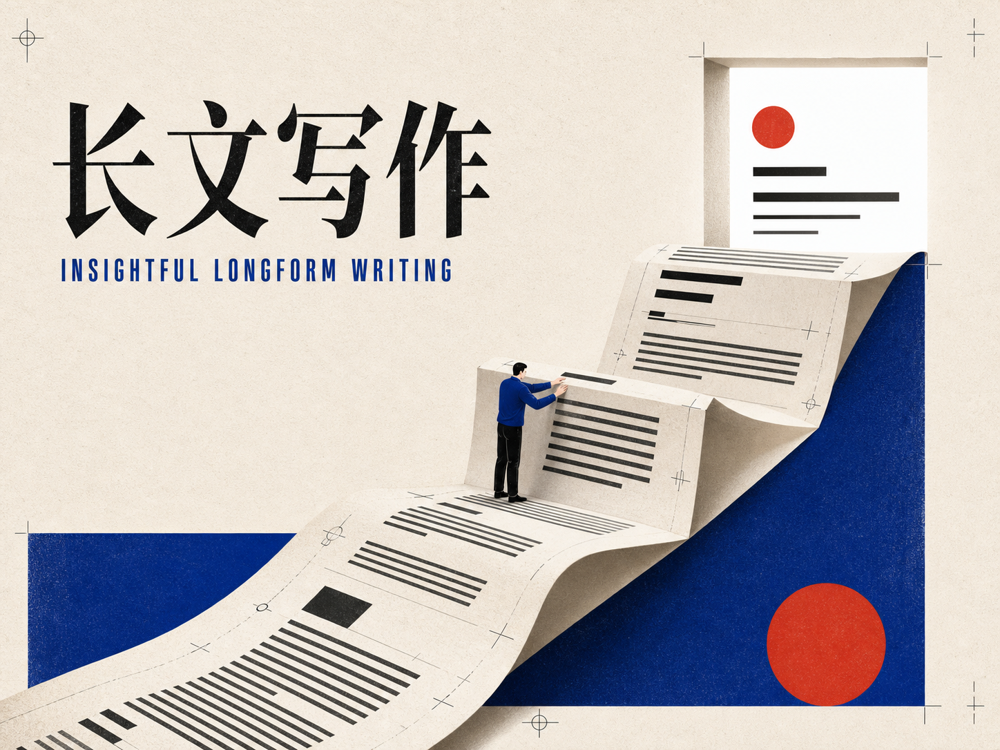

# Insightful Longform Writing Skill



一个面向中文长文写作的 Agent Skill，用来帮助 AI 写出“有观点、有洞察、能被读者读完并转述”的文章。

它不只是提示 AI “写得更好”，而是把一套完整的写作方法封装成可执行流程：从选题定位、文章大纲、逐章草稿、反馈修订、全文质检，到最后的插图规划。

## 适合写什么

这个 Skill 适合需要解释复杂概念、建立认知、输出观点或沉淀方法的中文长文，例如：

- 科普文章：把专业概念讲给“有一点基础但不深入”的读者。
- 产品解读：说明一个产品为什么重要、改变了什么、边界在哪里。
- 行业分析：从现象里拆出驱动力、关键变量和未来判断。
- 方法论文章：把经验整理成别人能照着做的步骤和检查清单。
- 组织经验：把团队实践沉淀成可复用的机制和洞察。
- 观点评论：围绕一个争议事件提出清晰立场和解释框架。

它不适合纯新闻快讯、SEO 拼接文、学术论文、营销硬广、短视频口播稿或只追求情绪煽动的内容。

## 核心特点

**先定位，再写作。** 写文章前先明确读者是谁、读多久、读完要改变什么，避免直接进入空泛生成。

**用具体场景开头。** 第一部分不设章节标题，前 3 句话内点题，用人物、任务和冲突把读者带进来。

**用递进结构替代并列罗列。** 避免“价值 1 / 价值 2 / 价值 3”式汇报，让每章回答一个问题，并自然铺到下一章。

**保留术语，但讲清术语。** 重要术语用中英对照、简明解释和具体类比处理，帮助读者建立词汇库。

**重视案例和细节。** 案例要写到动作、过程和验收标准，而不是停留在抽象形容词。

**结尾有闭环和行动。** 好结尾要呼应开头、升到更底层的规律，并给读者一个具体动作。

**默认逐章协作。** 除非用户明确要求一次性完整稿，否则 Skill 会先给定位和大纲，再逐章写草稿、等反馈、再修订。

## 目录结构

```text
insightful-longform-writing/
├── SKILL.md              # Skill 主文件，包含完整写作流程和执行规则
├── README.md             # 面向使用者和开源分发的说明
└── examples/
    └── prompts.md        # 常用调用示例
```

## 安装方式

### Pi

把整个目录复制到 Pi 的 Skill 目录之一：

```bash
mkdir -p ~/.pi/agent/skills
cp -R insightful-longform-writing ~/.pi/agent/skills/
```

也可以放在项目级目录：

```bash
mkdir -p .pi/skills
cp -R insightful-longform-writing .pi/skills/
```

重启 Pi 后，Skill 会在任务匹配时自动加载。也可以通过 Skill 命令显式调用：

```text
/skill:insightful-longform-writing 帮我写一篇关于 AI Agent 记忆机制的科普文章
```

### 其他 Agent Skills 兼容工具

只要工具支持 Agent Skills 标准，就可以把本目录放入对应的 skills 搜索路径。核心入口是 `SKILL.md`，其中包含 frontmatter 和完整操作说明。

## 基本用法

从零开始写一篇文章：

```text
帮我写一篇 3000 字左右的文章，主题是“为什么团队需要把 AI 使用经验沉淀成 Skill”。读者是用过 AI 但还没系统化的人。
```

只要大纲：

```text
先不要写正文。请用 insightful-longform-writing 的方法，给我一篇关于“个人知识管理为什么失败”的文章大纲。
```

逐章写作：

```text
大纲我确认了。先写引子和第一章，保持具体、有场景，不要写成报告。
```

修订已有文章：

```text
请按这个 Skill 的标准帮我检查这篇文章：开头是否点题、章节是否递进、案例是否具体、结尾是否有洞察。
```

规划插图：

```text
全文已经定稿。请根据 Skill 里的插图规划方法，帮我选 3-4 个最值得配图的位置，并写出生图 prompt。
```

更多示例见 `examples/prompts.md`。

## 推荐协作流程

1. 给出主题、读者、篇幅和目标。
2. 让 Agent 先输出写作定位和大纲。
3. 确认大纲后，一次只写一章。
4. 对结构、表达、节奏、案例分别反馈。
5. 全文完成后做一次通读质检。
6. 最后再规划插图，不要边写边规划图。

这种流程比“一口气生成完整文章”慢一点，但质量更稳定，也更适合需要发布的长文。

## 写作风格边界

这个 Skill 会主动避免：

- 标签式开场，例如“核心观点：XXX”。
- 汇报式并列，例如“价值 1 / 价值 2 / 价值 3”。
- 博客式自嗨，例如“我第一次听说时觉得很科幻”。
- 用大量 bullet list 切碎阅读节奏。
- 用“非常、超级、完美”等廉价情绪词撑语气。
- 伪造数据、报告、案例或引用。

如果你希望写成更口语、更犀利、更学术或更商业化的风格，可以在调用时明确说明。

## 开源前建议

发布到 GitHub 或其他平台后，建议继续补充：

- 示例文章：放入 `examples/`，展示从大纲到成稿的完整过程。
- 版本说明：如果持续迭代，可以增加 `CHANGELOG.md`。

## 许可证

本项目使用 MIT License，详见 `LICENSE`。
